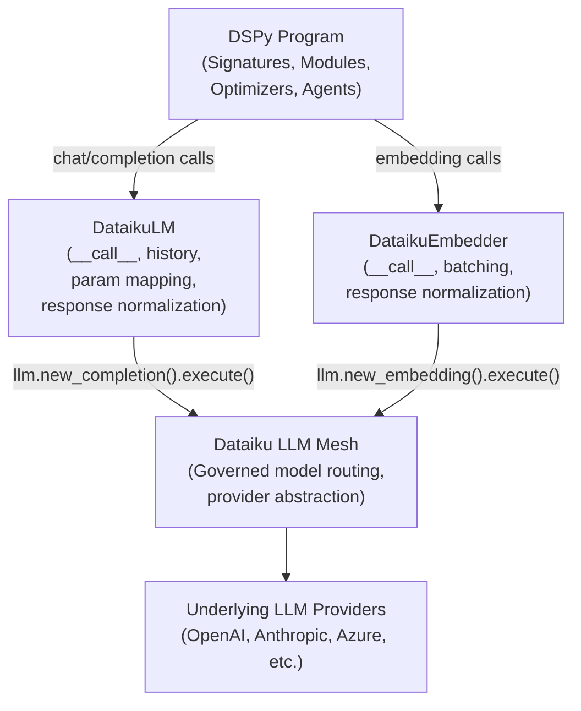

# DataikuLM for DSPy — Technical Design Document

**Version:** 1.0
**Status:** Draft
**Date:** 2026-07-22
**Based on PRD:** dataikulm-for-dspy-prd.md

---

## 1. Executive Summary

`DataikuLM` is a local Python module dropped into a Dataiku DSS project's `python-lib/` directory. It extends DSPy's `LM` base class to route all inference calls through Dataiku LLM Mesh instead of LiteLLM directly. A companion `DataikuEmbedder` class covers DSPy's retrieval and embedding workflows. No changes are made to DSPy or Dataiku LLM Mesh.

## 2. Technology Stack

| Layer | Choice | Rationale |
|-------|--------|-----------|
| Language | Python 3.10+ | PRD requirement; matches DSS code env baseline |
| Runtime / Platform | Dataiku DSS code environment | `dataiku` package always available; no import guards needed |
| Distribution | Local module in `python-lib/dspy_dku/` | Drop-in, no pip install; standard DSS project lib pattern |
| Core dependency | `dspy` (latest) | Target library; must not be modified |
| Core dependency | `dataiku` (DSS built-in) | LLM Mesh access; must not be modified |
| Database | None | Stateless adapter; no persistence |
| Auth | None (inherits Mesh) | Dataiku handles all credential resolution natively |
| API / Frontend | None | Pure Python library |
| Testing | `pytest` + `unittest.mock` | Unit tests mock all Mesh/DSPy I/O; integration tests are minimal |
| Linting / Formatting | None | Not required |
| Deployment | Copy to `python-lib/` of target DSS project | Standard DSS project code library mechanism |

## 3. System Architecture

The adapter sits between DSPy's reasoning/optimization layer and Dataiku LLM Mesh. All DSPy modules, signatures, teleprompting loops, and optimizers remain untouched; only the LM transport is replaced.



**Key design principle:** `DataikuLM.__call__` is a complete override of the parent's LiteLLM transport. The parent `dspy.LM.__init__` is called to correctly initialize DSPy internal state (history, kwargs, cache registry), but the parent `__call__` never executes. All inference is handled by the Dataiku Mesh client helper.

## 4. Data Model

There is no database. This section defines the request/response shapes exchanged at each boundary.

### 4.1 DSPy → DataikuLM (inbound call)

```python
# DSPy calls the LM with:
messages: list[dict]     # e.g. [{"role": "user", "content": "..."}, ...]
prompt:   str | None     # legacy text prompt (normalized to messages internally)
kwargs:   dict           # overrides: temperature, max_tokens, top_p, stop, n, tools, stream
```

### 4.2 DataikuLM → Dataiku Mesh (outbound call)

```python
# Translated to Dataiku Mesh completion settings:
{
  "messages": [...],           # passed through unchanged
  "temperature": float,        # direct pass-through
  "maxOutputTokens": int,      # mapped from max_tokens
  "topP": float,               # mapped from top_p
  "stopSequences": list[str],  # mapped from stop
  "tools": list[dict],         # passed through when present (tool-calling)
}
```

### 4.3 Dataiku Mesh → DataikuLM (Mesh response)

```python
resp.success: bool
resp.text: str                    # first choice text (convenience)
resp.choices: list[dict]          # full choices array, LiteLLM-compatible shape
resp.usage: dict                  # {"promptTokens": int, "completionTokens": int, "totalTokens": int}
# For tool calls:
resp.choices[0]["message"]["tool_calls"]: list[dict]
```

### 4.4 DataikuLM → DSPy (return value)

```python
# DSPy expects a list of completion strings (non-tool-call):
list[str]

# For tool-call responses, DSPy expects the raw choice message dict:
list[dict]   # [{"role": "assistant", "content": ..., "tool_calls": [...]}]

# History entry appended after each call:
{
  "prompt": messages,
  "response": raw_mesh_response,
  "kwargs": merged_kwargs,
  "usage": {"prompt_tokens": int, "completion_tokens": int, "total_tokens": int}
}
```

### 4.5 DSPy Embedder → DataikuEmbedder (inbound)

```python
inputs: list[str]   # texts to embed
```

### 4.6 DataikuEmbedder → DSPy (return value)

```python
list[list[float]]   # one embedding vector per input string
```

## 5. API Design

### 5.1 `DataikuLM` — public interface

```python
class DataikuLM(dspy.LM):
    def __init__(
        self,
        model: str,                    # Dataiku LLM connection ID (e.g. "openai-gpt4o")
        project_key: str | None = None,# DSS project key; auto-detected if None
        temperature: float = 0.0,
        max_tokens: int = 1024,
        cache: bool = True,
        **kwargs,                      # additional DSPy/Mesh pass-through params
    ): ...

    def __call__(
        self,
        prompt: str | None = None,
        messages: list[dict] | None = None,
        **kwargs,                      # per-call overrides (temperature, max_tokens, tools, n, stream, ...)
    ) -> list[str] | list[dict]: ...
```

**Usage example:**
```python
import dspy
from dspy_dku import DataikuLM

lm = DataikuLM(model="openai-gpt4o", temperature=0.1, max_tokens=512)
dspy.configure(lm=lm)

# All standard DSPy usage works unchanged from here
class MySignature(dspy.Signature):
    question: str = dspy.InputField()
    answer: str = dspy.OutputField()

predict = dspy.Predict(MySignature)
result = predict(question="What is 2+2?")
```

### 5.2 `DataikuEmbedder` — public interface

```python
class DataikuEmbedder:
    def __init__(
        self,
        model: str,                    # Dataiku embedding connection ID
        project_key: str | None = None,
    ): ...

    def __call__(
        self,
        inputs: list[str],
        **kwargs,
    ) -> list[list[float]]: ...
```

**Usage example:**
```python
from dspy_dku import DataikuEmbedder

embedder = DataikuEmbedder(model="openai-text-embedding-3-small")
vectors = embedder(["text one", "text two"])
```

### 5.3 `_MeshClient` — internal helper (not public API)

```python
class _MeshClient:
    def __init__(self, model: str, project_key: str | None): ...
    def complete(self, messages: list[dict], settings: dict) -> object: ...
    def embed(self, inputs: list[str]) -> list[list[float]]: ...
    def _get_project(self) -> object: ...
```

### 5.4 `_Normalizer` — internal helper (not public API)

```python
class _Normalizer:
    @staticmethod
    def to_mesh_settings(kwargs: dict) -> dict: ...
    # Maps: max_tokens→maxOutputTokens, top_p→topP, stop→stopSequences, etc.

    @staticmethod
    def prompt_to_messages(prompt: str) -> list[dict]: ...
    # Wraps plain string as [{"role": "user", "content": prompt}]

    @staticmethod
    def mesh_response_to_completions(resp) -> list[str]: ...
    # Extracts text from all choices

    @staticmethod
    def mesh_response_has_tool_calls(resp) -> bool: ...

    @staticmethod
    def mesh_response_to_tool_dicts(resp) -> list[dict]: ...
    # Returns raw choice message dicts for tool-calling workflows

    @staticmethod
    def mesh_usage_to_dspy_usage(resp) -> dict: ...
    # Maps promptTokens→prompt_tokens, etc.
```

## 6. Feature Implementation Plan

### Feature 1: Core LM Adapter Interface
- **Module:** `lm.py` (`DataikuLM`), `_mesh.py` (`_MeshClient`), `_normalizer.py`
- **Data flow:** DSPy calls `DataikuLM.__call__` → `_Normalizer.to_mesh_settings` maps params → `_MeshClient.complete` executes Mesh call → `_Normalizer.mesh_response_to_completions` extracts output → `self.history` appended → return list of strings
- **Error handling:**
  - If `resp.success` is False, raise `RuntimeError` with Mesh error message
  - If both `prompt` and `messages` are None, raise `ValueError`
  - If `prompt` is provided, normalize to messages via `_Normalizer.prompt_to_messages`
  - Unsupported Mesh params are dropped with a `warnings.warn` call (not silent, not fatal)

### Feature 2: Teleprompting and Optimizer Compatibility
- **Module:** No special code needed beyond Feature 1
- **Data flow:** Teleprompting loops call `DataikuLM.__call__` repeatedly; history is accumulated on `self.history` per DSPy conventions
- **Key requirement:** `temperature`, `max_tokens`, and `stop` must pass through reliably — these are used heavily by optimizer scoring/candidate generation
- **Multi-candidate (`n > 1`):** `n` is passed in kwargs to `_Normalizer.to_mesh_settings` and forwarded to Mesh. If Mesh returns fewer than `n` choices, the available choices are returned and a warning is emitted. DSPy callers must tolerate this.

### Feature 3: Agent Workflow Support
- **Module:** `lm.py`
- **Data flow:** ReAct and multi-step agents pass message lists with conversation history; `DataikuLM.__call__` passes messages through unchanged
- **Key requirement:** Message role fidelity must be preserved (`system`, `user`, `assistant`) — no normalization that strips roles
- **Edge cases:** If conversation history is very long, Mesh may reject the request due to context limits; surface the Mesh error clearly rather than silently truncating

### Feature 4: Tool/Function Calling
- **Module:** `lm.py`, `_normalizer.py`
- **Data flow:** DSPy passes `tools` (list of function schemas) and optionally `tool_choice` in kwargs → these are forwarded to Mesh settings → Mesh returns tool_calls in response choices → `_Normalizer.mesh_response_has_tool_calls` detects this → `_Normalizer.mesh_response_to_tool_dicts` returns raw choice dicts → DSPy receives list of dicts (not strings)
- **Return type switch:** `__call__` returns `list[str]` normally; when tool_calls are present, returns `list[dict]` containing the full message dict including `tool_calls`
- **Edge cases:** If the underlying model doesn't support tool calling (Mesh returns an error or empty tool_calls), raise `NotImplementedError` with a clear message identifying the connection name

### Feature 5: Structured Output Support
- **Module:** `lm.py`, `_normalizer.py`
- **Data flow:** DSPy may pass `response_format={"type": "json_object"}` or similar in kwargs → forwarded to Mesh settings → Mesh response is returned as-is; JSON parsing is DSPy's responsibility
- **Edge cases:** If Mesh returns malformed JSON (model non-compliance), this is surfaced to DSPy as a raw string; DSPy's own structured output parser handles retries

### Feature 6: Embeddings and Retrieval Interface
- **Module:** `embedder.py` (`DataikuEmbedder`), `_mesh.py`
- **Data flow:** DSPy retrieval components call `DataikuEmbedder.__call__(inputs)` → `_MeshClient.embed` calls Dataiku embedding endpoint → returns `list[list[float]]`
- **Batching:** Inputs are sent as a single batch to Mesh; if Mesh has a batch size limit, split into chunks of 100 and concatenate results
- **Edge cases:** If the connection does not support embeddings, Mesh returns an error; surface with `NotImplementedError`

### Feature 7: Async Execution and Batching (nice-to-have)
- **Module:** `lm.py`
- **Approach:** Implement `acall` async method that wraps `__call__` in `asyncio.to_thread` (thread-pool offload) since Dataiku Mesh client is synchronous
- **Batching:** For `n > 1` scenarios, the synchronous path already requests `n` completions in a single Mesh call; true parallel batching is not supported in v1

### Feature 7b: Streaming (nice-to-have)
- **Module:** `lm.py`
- **Approach:** If `stream=True` is passed, check if Mesh supports streaming for the connection; if not, set `stream=False` with a warning and fall back to standard completion
- **If Mesh streaming is available:** Wire generator-based streaming response into DSPy's streaming interface

### Feature 7c: Caching and Usage Accounting (nice-to-have)
- **Module:** `lm.py`
- **Caching:** DSPy's native cache (`dspy.cache`) keys on (model, messages, kwargs). Because `DataikuLM` extends `dspy.LM` with `cache=True`, DSPy's cache will wrap `__call__` if enabled. No additional cache layer needed.
- **Usage accounting:** After every call, normalize Mesh usage stats into `self.history[-1]["usage"]` with keys `prompt_tokens`, `completion_tokens`, `total_tokens`

## 7. Non-Functional Requirements Implementation

| Category | Implementation |
|----------|----------------|
| Performance | `_Normalizer` is pure Python with no I/O; overhead is negligible. Mesh round-trip latency dominates. No unnecessary copies of message lists. |
| Security | No credentials handled in adapter; all auth deferred to Dataiku's LLM Mesh client. Model connection IDs are strings passed by the user; no dynamic eval or shell execution. |
| Scalability | Repeated calls during optimizer loops are fully supported; each call is independent and stateless except for `self.history` accumulation. History can be cleared via `self.history.clear()` if memory is a concern. |
| Compliance | Inherits all Dataiku governance controls (model routing, access policies, audit logging) because all calls go through `llm.execute()` via the official Dataiku client. |

## 8. Project Structure

```
dataiku_dspy/                        ← workspace / repo root
│
├── python-lib/                      ← DSS project code library (auto on sys.path in DSS)
│   └── dspy_dku/
│       ├── __init__.py              ← exports: DataikuLM, DataikuEmbedder
│       ├── lm.py                    ← DataikuLM class
│       ├── embedder.py              ← DataikuEmbedder class
│       ├── _mesh.py                 ← _MeshClient (internal)
│       ├── _normalizer.py           ← _Normalizer (internal)
│       └── _types.py                ← type aliases (MeshResponse, CompletionSettings, etc.)
│
├── tests/
│   ├── conftest.py                  ← shared fixtures (mock Mesh client, sample messages)
│   ├── unit/
│   │   ├── test_lm.py               ← DataikuLM unit tests (all Mesh calls mocked)
│   │   ├── test_embedder.py         ← DataikuEmbedder unit tests
│   │   └── test_normalizer.py       ← _Normalizer mapping unit tests
│   └── integration/
│       ├── test_lm_integration.py   ← minimal live DSPy workflow (1-2 real LLM calls)
│       └── test_embedder_integration.py  ← minimal live embed call
│
├── planning.md
├── chat_history.md
├── dataikulm-for-dspy-prd.md
└── dataikulm-for-dspy-design.md     ← this file
```

**Note on DSS path:** In a live DSS code environment, `python-lib/` is automatically added to `sys.path`. The `import dataikulm` statement works without any additional configuration once the files are in place.

## 9. Testing Plan

### Unit Tests (`tests/unit/`)

All unit tests mock `_MeshClient` completely. No real Dataiku or LLM calls are made.

| Test file | Key scenarios |
|-----------|---------------|
| `test_normalizer.py` | `max_tokens→maxOutputTokens`, `top_p→topP`, `stop→stopSequences`, prompt string normalization to messages, multi-choice extraction, tool-call detection, usage field mapping |
| `test_lm.py` | Successful completion returns list of strings; tool-call response returns list of dicts; `n > 1` returns correct number of completions; Mesh failure raises `RuntimeError`; history is appended correctly; unsupported params emit `warnings.warn`; `prompt` argument is normalized to messages |
| `test_embedder.py` | Returns correct shape `list[list[float]]`; batch splitting at 100 inputs; Mesh error raises `NotImplementedError` for unsupported embedding connections |

### Integration Tests (`tests/integration/`)

Integration tests require a live DSS instance with configured LLM connections. They are marked `@pytest.mark.integration` and skipped by default (`pytest -m "not integration"`).

Token-efficiency rules:
- Use the shortest possible prompts ("Say yes." / "1+1=")
- Set `max_tokens=10` on all integration calls
- Use `temperature=0` for determinism
- Run at most 2 real LLM calls per test

| Test file | Scenarios |
|-----------|-----------|
| `test_lm_integration.py` | End-to-end `dspy.Predict` with `DataikuLM`; verify response is non-empty string; verify history entry exists |
| `test_embedder_integration.py` | Single embed call; verify output is `list[list[float]]` with correct dimensions |

### Running Tests

```bash
# Unit tests only (no DSS required)
pytest tests/unit/

# All tests including integration (requires live DSS)
pytest tests/ -m "integration"
```

## 10. Deployment & Infrastructure

**No build, containerization, or CI/CD pipeline is required.** The deployment process is:

1. Copy `python-lib/dataikulm/` into the target DSS project's `python-lib/` folder via:
   - DSS UI: Project → Settings → Code libraries → Add Python files
   - Or manually place files on the DSS server filesystem
2. Ensure `dspy` is installed in the target DSS code environment
3. Import and use:
   ```python
   from dspy_dku import DataikuLM
   import dspy
   lm = DataikuLM(model="your-llm-connection-id")
   dspy.configure(lm=lm)
   ```

**Environment / secrets:** No environment variables or secrets are needed in the adapter. LLM connection IDs are plain strings. All authentication is handled by the Dataiku platform.

## 11. Open Technical Decisions

| # | Decision | Options | Recommendation |
|---|----------|---------|----------------|
| 1 | Exact DSPy base class to extend | `dspy.LM` vs `dspy.BaseLM` vs duck-type | Extend `dspy.LM`; verify `__init__` doesn't validate model against LiteLLM providers at import time before committing |
| 2 | Exact Dataiku Mesh Python API for embeddings | `llm.new_embedding()` vs alternative endpoint | Verify `new_embedding()` availability in DSS 14 before implementing `DataikuEmbedder._mesh.embed()` |
| 3 | Streaming support mechanism | `asyncio.to_thread` wrapper vs native streaming if available | Implement synchronous path first; add streaming in a follow-up once Mesh streaming support is confirmed |
| 4 | `n > 1` completions | Forward `n` to Mesh and let it handle vs issue `n` serial calls | Forward to Mesh first; fall back to serial calls if Mesh ignores `n` (verify per connection type) |
| 5 | DSPy cache integration | Rely on `dspy.LM` cache wrapper vs implement own cache | Rely on DSPy's built-in cache since we extend `dspy.LM` with `cache=True`; verify cache works correctly with overridden `__call__` |
| 6 | Tool-call return type | Return `list[str]` always vs return `list[dict]` for tool-call responses | Return `list[dict]` when tool_calls detected; verify this matches what DSPy's ReAct/tool-calling modules expect in latest version |
